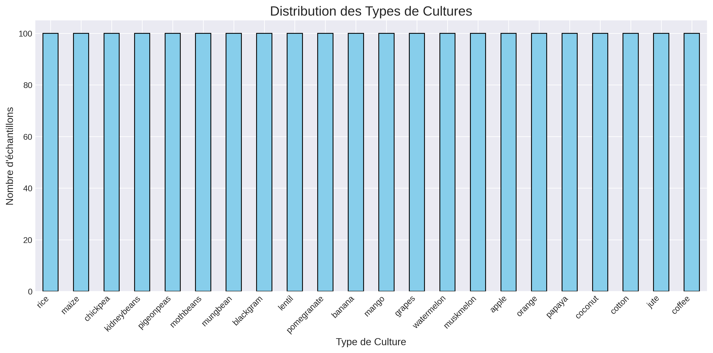
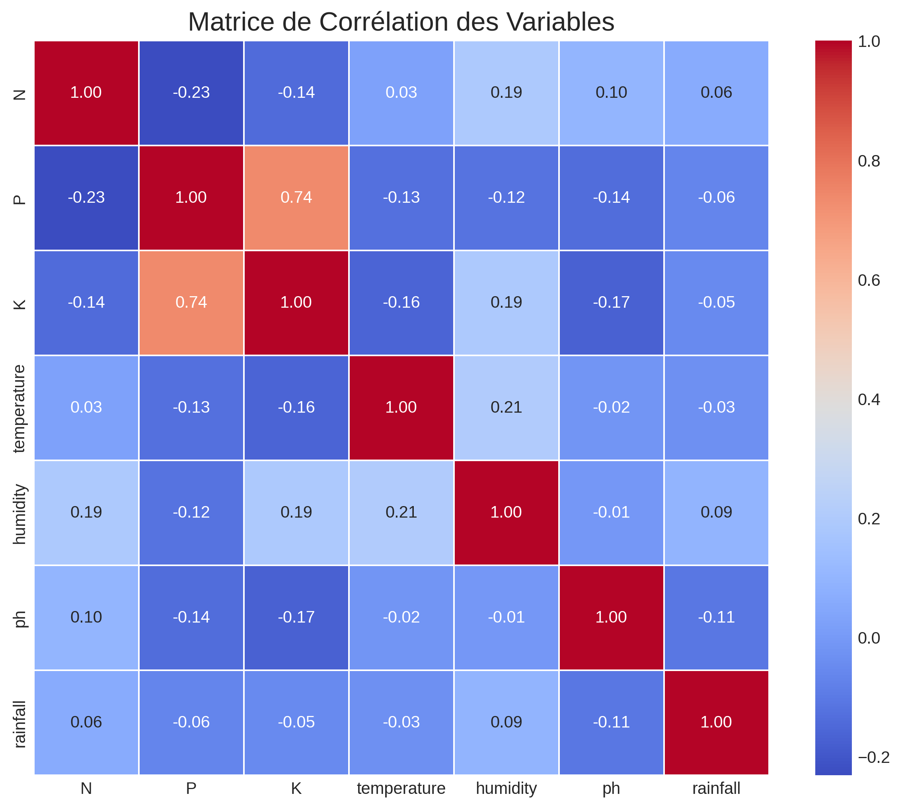
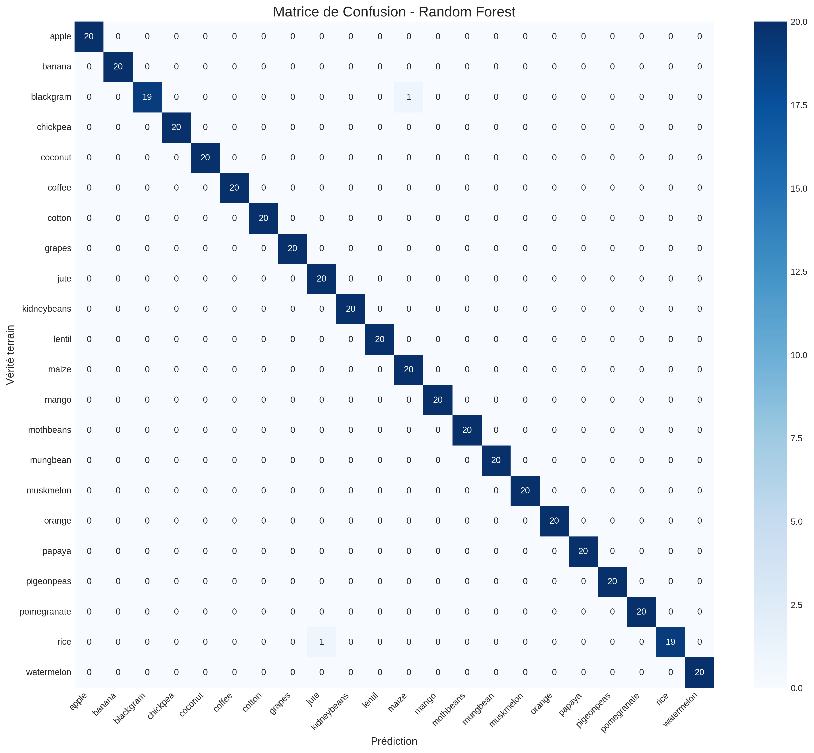

# 🌾 Projet Force N - Système de Recommandation de Cultures Agricoles

> **Un système de machine learning pour aider les agriculteurs à choisir la culture optimale en fonction des caractéristiques du sol et des conditions climatiques.**

---

## 📋 Description du Projet

Ce projet propose une solution basée sur l'intelligence artificielle pour recommander la culture la plus adaptée à un terrain agricole. En analysant 7 paramètres clés (azote, phosphore, potassium, température, humidité, pH et pluviométrie), le système prédit avec une précision de **99.55%** la culture optimale parmi 22 types différents.

### 🎯 Objectifs
- **Prédire** la culture la plus adaptée à partir de données agronomiques
- **Aider** les agriculteurs à optimiser leurs rendements
- **Réduire** l'impact environnemental en évitant les cultures inadaptées
- **Démocratiser** l'accès à l'agronomie de précision via une interface simple

### 📊 Données utilisées
- **Source :** Kaggle - Crop Recommendation Dataset
- **Échantillons :** 2 200
- **Cultures :** 22 types (riz, maïs, blé, pomme, etc.)
- **Caractéristiques :** 7 variables agronomiques

---

## 🚀 Résultats et Performance

| Modèle | Précision | F1-Score | Validation Croisée |
|--------|-----------|----------|-------------------|
| Régression Logistique | 97.27% | 97.25% | 96.76% |
| Arbre de Décision | 97.95% | 97.94% | 98.47% |
| **Random Forest** | **99.55%** | **99.55%** | **99.32%** |
| XGBoost | 99.09% | 99.08% | 98.92% |

🏆 **Meilleur modèle : Random Forest avec 99.55% de précision**

---

## 🏗️ Architecture du Projet


---

## 🔬 Méthodologie

### 1️⃣ Analyse Exploratoire (EDA)
- Statistiques descriptives des données
- Visualisation des distributions
- Matrice de corrélation entre variables
- Détection et analyse des outliers

### 2️⃣ Prétraitement des Données
- **Encodage** : Transformation des 22 cultures en labels numériques (0-21)
- **Normalisation** : StandardScaler (moyenne=0, écart-type=1)
- **Split** : 80% entraînement, 20% test (stratifié)

### 3️⃣ Modélisation
Quatre modèles ont été testés et comparés :
- **Régression Logistique** : Modèle linéaire de référence
- **Arbre de Décision** : Modèle interprétable
- **Random Forest** : Ensemble d'arbres (meilleur modèle)
- **XGBoost** : Gradient boosting performant

### 4️⃣ Évaluation
- Métriques : Accuracy, F1-Score, Précision, Rappel
- Validation croisée : 5 folds
- Matrice de confusion pour analyser les erreurs

---

## 📊 Visualisations

### Distribution des Cultures


### Matrice de Corrélation


### Comparaison des Modèles


### Matrice de Confusion


---

## 🛠️ Technologies Utilisées

| Technologie | Version | Rôle |
|-------------|---------|------|
| **Python** | 3.8+ | Langage principal |
| **Pandas** | 2.0+ | Manipulation des données |
| **NumPy** | 1.24+ | Calcul numérique |
| **Scikit-learn** | 1.2+ | Machine Learning |
| **XGBoost** | 1.7+ | Modèle Gradient Boosting |
| **Gradio** | 4.0+ | Interface utilisateur |
| **Matplotlib** | 3.7+ | Visualisation |
| **Seaborn** | 0.12+ | Visualisation avancée |
| **Joblib** | 1.2+ | Sauvegarde des modèles |

---

## 🚀 Installation et Exécution

### Prérequis
```bash
# Python 3.8 ou supérieur
python --version
```

1. Cloner le dépôt
```bash
git clone https://github.com/votre-compte/projet-force-n.git
cd projet-force-n
```

2. Installer les dépendances
```bash
pip install -r requirements.txt
```

3. Exécuter le Notebook (recommandé)
```bash
# Dans Google Colab
# Ouvrir Projet_Force_N.ipynb et exécuter toutes les cellules

# Ou en local
jupyter notebook Projet_Force_N.ipynb
```

4. Exécuter le script Python
```bash
python projet_force_n.py
```

5. Lancer l'interface Gradio
```python
# Dans le notebook, la dernière cellule lance Gradio
# Ou en ligne de commande :
python -c "from projet_force_n import create_interface; create_interface().launch()"
```

📖 Guide d'Utilisation de l'Interface
1. Saisie des paramètres
Ajustez les 7 curseurs pour entrer les valeurs de votre sol et climat :

*   **N** : Azote (0-140 kg/ha)

*   **P** : Phosphore (0-145 kg/ha)

*   **K** : Potassium (0-205 kg/ha)

*   **Température** : (15-35°C)

*   **Humidité** : (40-90%)

*   **pH** : (4.5-8.5)

*   **Pluviométrie** : (50-300 mm)

2. Prédiction
Cliquez sur "Prédire la Culture" pour obtenir :

*   La culture recommandée

*   Le niveau de confiance du modèle

*   Le top 5 des cultures alternatives

*   Un graphique des probabilités

3. Exemples pré-remplis
Utilisez les exemples pour tester rapidement le système :

| Exemple | Culture | N | P | K | Temp | Humidité | pH | Pluie |
|---------|---------|---|---|---|------|----------|----|-------|
| 1       | Riz     | 90| 42| 43| 20.9 | 82.0     | 6.50 | 202.9 |
| 2       | Mais    | 78| 48| 20| 22.4 | 65.1     | 6.25 | 84.8  |
| 3       | Pomme   | 21| 134| 200| 22.6 | 92.3     | 5.93 | 112.7 |
| 4       | Banane  | 100| 82| 50| 27.4 | 80.4     | 5.98 | 104.6 |

📈 Améliorations Futures
| Axe             | Description                      | Impact potentiel     |
|-----------------|----------------------------------|----------------------|
| Hyperparamètres | Optimisation avec GridSearchCV   | +0.5% précision      |
| Nouvelles variables | Type de sol, topographie     | Meilleure adaptation |
| Deep Learning   | Réseaux de neurones              | +1% précision        |
| API REST        | Déploiement en production        | Accessibilité        |
| Application mobile | Interface smartphone         | Utilisation terrain  |

👥 Équipe Projet
| Rôle                        | Nom                  | Email                          | Contributions                                                |
|-----------------------------|----------------------|--------------------------------|--------------------------------------------------------------|
| Chef de Projet / Data Scientist | Ilimane GNING        | gning.ilimane@ugb.edu.sn         | Coordination, Modélisation, Documentation, Interface Gradio, Design |
| Data Scientist              | ABDOU KHADRE DIALLO  | abdoukhadre.diallo@ugb.edu.sn    | EDA, Modèles, Optimisation                                   |
| Data Engineer               | FATOU FAYE           | fatou.faye@ugb.edu.sn            | Prétraitement, Déploiement                                   |

📚 Références
*   Crop Recommendation Dataset - Kaggle

*   Scikit-learn Documentation

*   XGBoost Documentation

*   Gradio Documentation

*   Random Forest Classifier

📄 Licence
Ce projet est sous licence MIT.

📞 Contact
Équipe du Projet
| Nom                  | Email                          | Rôle                                        |
|----------------------|--------------------------------|---------------------------------------------|
| Ilimane GNING        | gning.ilimane@ugb.edu.sn         | Chef de Projet, Data Scientist, Interface Gradio |
| ABDOU KHADRE DIALLO  | abdoukhadre.diallo@ugb.edu.sn    | Data Scientist                              |
| FATOU FAYE           | fatou.faye@ugb.edu.sn            | Data Engineer                               |

GitHub : [https://github.com/votre-compte]

📅 Dernière mise à jour : 2026-07-28
📌 Version : 1.0
🏷️ Statut : Production Ready
